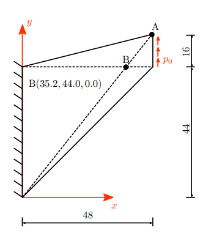
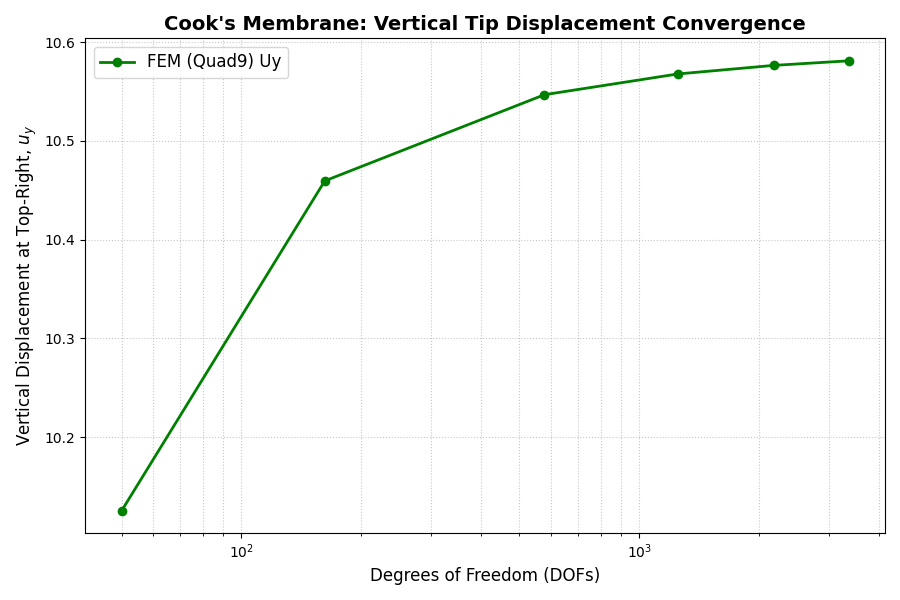
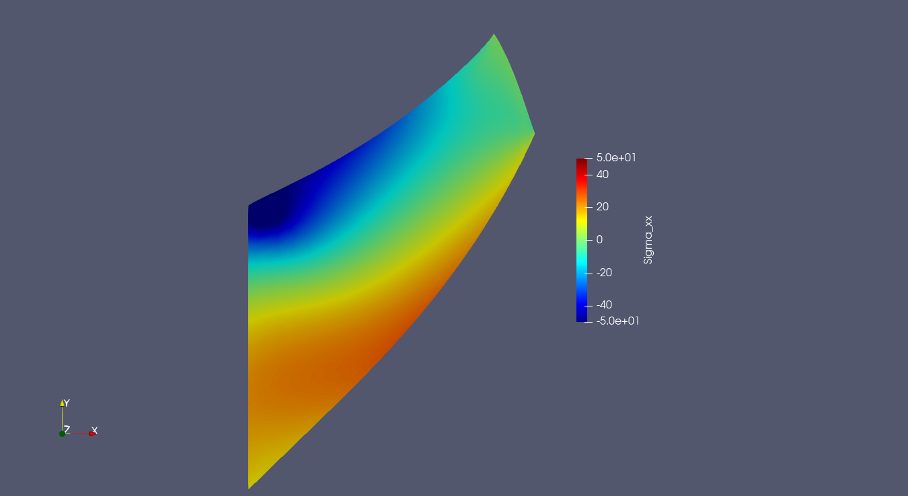

# Hyperelasticity: Cook's Membrane

## Cook's Membrane

This example solves the classical **Cook's membrane** benchmark using a compressible hyperelastic material.

The benchmark consists of a tapered cantilever that is fully clamped on the left edge and subjected to a constant upward shear traction on the right edge. Because of the combined bending and shear, the problem is frequently used to assess the performance of finite element formulations under large deformations.

This implementation follows the benchmark proposed in the SPP-1748 collection of solid mechanics benchmark problems. Only the first strain-energy function ($\Psi_1$) from the paper is implemented.



---

## Governing equations

The equilibrium equation in the reference configuration is

$$
-\nabla \cdot \mathbf{P}=0
\qquad\text{in }\Omega,
$$

where $\mathbf P$ is the first Piola-Kirchhoff stress tensor.

The deformation gradient is

$$
\mathbf F=\mathbf I+\nabla\mathbf u,
$$

with Jacobian

$$
J=\det(\mathbf F).
$$

For the benchmark material model ($\Psi_1$), the strain-energy density is

$$
\Psi(\mathbf C) = \frac{\mu}{2}(\text{tr}\mathbf C-3) - \mu\ln J + \frac{\lambda}{4}(J^2-1) - \frac{\lambda}{2}\ln J,
$$

where

$$
\mathbf C=\mathbf F^T\mathbf F.
$$

The second Piola-Kirchhoff stress is related to it by

$$S = 2\frac{\partial \Psi}{\partial C}$$

Taking the derivative and simplifying yields the expression below
$$S = \frac{\lambda}{2}(J^2- 1)\mathbf C^{-1} + \mu (\mathbf I -\mathbf C^{-1})$$

The resulting first Piola-Kirchhoff stress is found after applying the relation $P = F S$

$$
\mathbf P = \mu\mathbf F + \left(\frac{\lambda}{2}(J^2-1)-\mu\right)\mathbf F^{-T},
$$

which is exactly the constitutive model implemented in this example.

---

## Weak formulation

The weak form is

Find $u \in H^1$ such that

$$
\int_\Omega\mathbf P :\nabla\mathbf{v}\,d\Omega=\int_{\Gamma_N}\mathbf t\cdot\mathbf{v}\,d\Gamma.
$$

holds for all $v \in H^1$

Since the framework is residual based, this expression is assembled directly into the nonlinear residual, while the consistent tangent matrix is obtained automatically through dual-number automatic differentiation.


---

## Discretization

- Mesh type: unstructured
- Element: Quad9
- Function space:
  - $V_h \subset H^1$

Approximation:

$$
u_h = \sum_i U_i \phi_i
$$

---

## Implementation details
The full file implemenation will be on [example_cook_hyper.py](./example_cook_hyper.py)


We begin our file with the needed imports:
```python
import numpy as np
import gmsh
import os
import time
import matplotlib.pyplot as plt

from fem_engine.external_mesh import import_mesh
from fem_engine.mesh import FunctionSpace
from fem_engine.bcs import DirichletBC, NeumannBC
from fem_engine.assembler import Assembler
from fem_engine.fem_solver import solve_newton_raphson
from fem_engine.element import Quad9
from fem_engine.postprocess import export_vtu, extrapolate_gauss_to_nodes, evaluate_field_at_point
```

We begin by defining the parameters of our problem

```python
# 1. Physics Parameters (SPP-1748 Benchmark Table 2.1)
lambda_ = 432.099
mu = 185.185
p0 = 20.0 # Constant shear load

# Cook's Membrane Geometry
x_left = 0.0
x_right = 48.0
y_bottom_left = 0.0
y_top_left = 44.0
y_bottom_right = 44.0
y_top_right = 60.0
```

We will define the weak form. We, whenever needing to defien matrix or multidimensional values, define them element by element whenever possible.

```python
# 2. SPP-1748 Hyperelastic Weak Form (psi_1)
def spp1748_hyperelasticity(N, B_x, u_gp, grad_u, x_gp, e):
    """
    1st PK Stress derived from: 
    S = 0.5 * lambda * (J^2 - 1) * C^-1 + mu * (I - C^-1)
    P = F * S = mu * F + [0.5 * lambda * (J^2 - 1) - mu] * F^-T
    """
    F = np.eye(2, dtype=grad_u.dtype) + grad_u.T
    J = F[0,0] * F[1,1] - F[0,1] * F[1,0]
    
    # F^-T (Inverse Transpose)
    FinvT = np.zeros((2, 2), dtype=grad_u.dtype)
    FinvT[0,0] =  F[1,1] / J
    FinvT[0,1] = -F[1,0] / J
    FinvT[1,0] = -F[0,1] / J
    FinvT[1,1] =  F[0,0] / J
    
    coeff = 0.5 * lambda_ * (J**2 - 1.0) - mu
    
    P = np.zeros((2, 2), dtype=grad_u.dtype)
    P[0,0] = mu * F[0,0] + coeff * FinvT[0,0]
    P[0,1] = mu * F[0,1] + coeff * FinvT[0,1]
    P[1,0] = mu * F[1,0] + coeff * FinvT[1,0]
    P[1,1] = mu * F[1,1] + coeff * FinvT[1,1]
    
    return B_x.T @ P.T
```

The Cauchy stress is computed from the deformation field to obtain the true physical stress in the current configuration. That is:

$$
\sigma = \frac{1}{J} \mathbf{P} \mathbf{F}^T
$$

```python
def compute_spp1748_stress(u_gp, grad_u):
    """Cauchy stress recovery for post-processing: sigma = (P * F^T) / J"""
    F = np.eye(2) + grad_u.T
    J = F[0,0]*F[1,1] - F[0,1]*F[1,0]

    FinvT = np.zeros((2,2))
    FinvT[0,0] =  F[1,1]/J
    FinvT[0,1] = -F[1,0]/J
    FinvT[1,0] = -F[0,1]/J
    FinvT[1,1] =  F[0,0]/J

    coeff = 0.5 * lambda_ * (J**2 - 1.0) - mu
    P = np.zeros((2,2))
    P[0,0] = mu * F[0,0] + coeff * FinvT[0,0]
    P[0,1] = mu * F[0,1] + coeff * FinvT[0,1]
    P[1,0] = mu * F[1,0] + coeff * FinvT[1,0]
    P[1,1] = mu * F[1,1] + coeff * FinvT[1,1]

    sigma = (P @ F.T) / J
    sigma_xx = sigma[0,0]
    
    return sigma_xx
```
We then define a function to generate our quadratic mesh

```python
def generate_cooks_membrane(filename, n_elements):
    gmsh.initialize()
    gmsh.option.setNumber("General.Terminal", 0)
    gmsh.model.add("CooksMembrane")

    p1 = gmsh.model.geo.addPoint(x_left, y_bottom_left, 0)
    p2 = gmsh.model.geo.addPoint(x_right, y_bottom_right, 0)
    p3 = gmsh.model.geo.addPoint(x_right, y_top_right, 0)
    p4 = gmsh.model.geo.addPoint(x_left, y_top_left, 0)

    l1 = gmsh.model.geo.addLine(p1, p2)
    l2 = gmsh.model.geo.addLine(p2, p3)
    l3 = gmsh.model.geo.addLine(p3, p4)
    l4 = gmsh.model.geo.addLine(p4, p1)

    cl = gmsh.model.geo.addCurveLoop([l1, l2, l3, l4])
    surf = gmsh.model.geo.addPlaneSurface([cl])

    # Force a structured grid
    for line in [l1, l2, l3, l4]:
        gmsh.model.geo.mesh.setTransfiniteCurve(line, n_elements + 1)
    
    gmsh.model.geo.mesh.setTransfiniteSurface(surf)
    gmsh.model.geo.mesh.setRecombine(2, surf)

    gmsh.model.geo.synchronize()
    gmsh.model.mesh.generate(2)

    # Force strict 9-node Quad9 elements
    gmsh.option.setNumber("Mesh.SecondOrderIncomplete", 0)
    gmsh.model.mesh.setOrder(2)

    gmsh.write(filename)
    gmsh.finalize()
```

Now, in the main part, we define some mesh densities to compare the results and convergence

```python
element_densities = [2, 4, 8, 12, 16, 20]

dofs_list = []
uy_tip_list = []

print("\n" + "="*60)
print("STARTING SPP-1748 COOK'S MEMBRANE CONVERGENCE STUDY")
print("="*60)

total_start_time = time.time()
```

And loop through the densities to define the problem. Due to the non linearity of the problem, we implement an incremental load stepping to solve the problem, that is: the constant shear load over the edge is equal to 20 MPa, but we apply a lower value and use the results for the next Newton-Raphson solve with the (incremented) load, untill we reach the load we want.

```python
for n_el in element_densities:
    print(f"\n--- Solving for {n_el}x{n_el} element grid ---")
    msh_file = f"results/cooks_membrane_{n_el}x{n_el}.msh"
    
    generate_cooks_membrane(msh_file, n_el)
    mesh = import_mesh(msh_file, element_type="quad9")
    
    V = FunctionSpace(mesh, Quad9(), n_components=2)
    assembler = Assembler(V, spp1748_hyperelasticity, quad_degree=3)

    U_current = np.zeros(V.ndofs)
    n_steps = 4

    # Incremental Load
    for step in range(1, n_steps + 1):
        current_traction = p0 * (step / n_steps) 
        
        def apply_bcs(R, K, U):
            tol = 1e-5
            
            # Apply Upward Traction to the right edge (Neumann)
            bc_neumann = NeumannBC(V, load_vector=[0.0, current_traction], boundary_marker_func=lambda x, y: x > x_right - tol)
            R, K = bc_neumann.apply(R, K, U)
            
            # Fully Clamp the left edge (Dirichlet)
            def left_edge(x, y): return x < tol
            bcs_dirichlet = [
                DirichletBC(V, value=0.0, boundary_marker_func=left_edge, component=0),
                DirichletBC(V, value=0.0, boundary_marker_func=left_edge, component=1)
            ]
            
            for bc in bcs_dirichlet:
                R, K = bc.apply(R, K, U)
            return R, K

        # Solve
        U_current = solve_newton_raphson(U_current, assembler.assemble, apply_bcs, nr_tol=1e-5, max_iter=5)

    # Evaluate displacement at top-right tip
    target_pt = np.array([x_right, y_top_right])
    val = evaluate_field_at_point(mesh, V, U_current, target_pt)
    uy_tip = val[1]
    
    dofs_list.append(V.ndofs)
    uy_tip_list.append(uy_tip)
    
    print(f"-> DOFs: {V.ndofs} | Final Tip Uy: {uy_tip:.5f}")

    # Export the finest mesh results for ParaView
    if n_el == element_densities[-1]:
        export_vtu(V, U_current, "results/cooks_spp1748_disp.vtu", field_name="Displacement")
        V_stress, U_stress = extrapolate_gauss_to_nodes(V, U_current, compute_spp1748_stress, n_components=1)
        export_vtu(V_stress, U_stress, "results/cooks_spp1748_stress.vtu", field_name="Sigma_xx")
```
We'll check the value which for the y displacement at the point A. The reference uses triangular elements with quadratic shape functions, and for the most refined value available $u_y = 10.59191221$



And also the $\sigma_{xx}$ in the current configuration


## References

1. Schröder, J., Wick, T., Reese, S., Wriggers, P., et al. (2021).
   *A Selection of Benchmark Problems in Solid Mechanics and Applied Mathematics.*
   Archives of Computational Methods in Engineering, 28, 713–751.
   https://doi.org/10.1007/s11831-020-09477-3