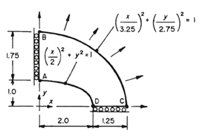
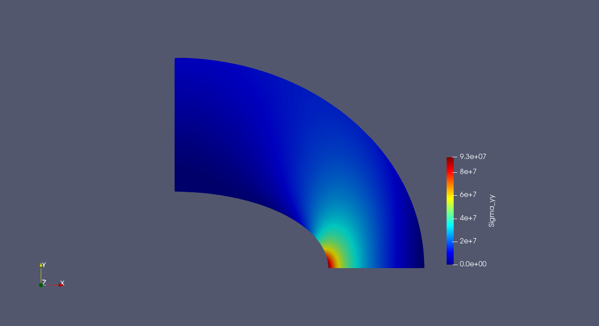
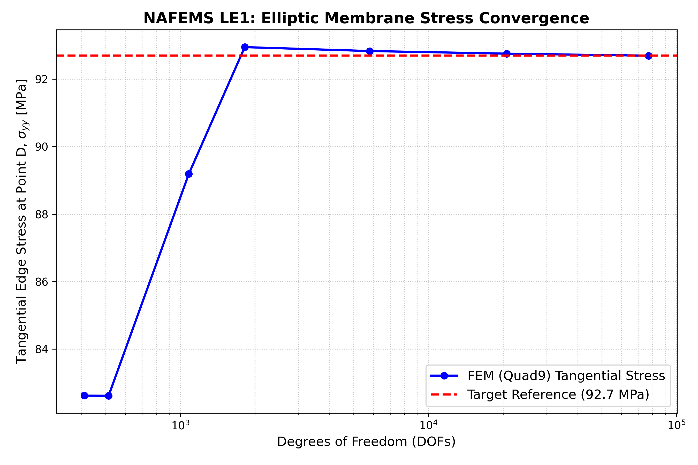

# <Problem Name>

## Eliptic membrane

We will solve the elipic membrane problem within plane stress
 hole under constant in-plane tension

The problem definition is: 



Due to the problem symmetry we will only model a quarter of it.

The outer edge is defined by

$$
\left(\frac{X}{3.25}\right)^{2} + \left(\frac{Y}{2.75}\right)^{2} = 1
$$

And the inner:

$$
\left(\frac{X}{2}\right)^{2} + \left(\frac{Y}{1}\right)^{2} = 1
$$

Dimensions in meters

---

## Governing equations

The strong form:

$$
-\nabla \cdot \sigma(u) = f \quad \text{in } \Omega
$$

$$
u = g \quad \text{on } \Gamma_D
$$

$$
\sigma n = t \quad \text{on } \Gamma_N
$$

With

$$
\epsilon(u) = \frac{1}{2} (\nabla u + (\nabla u)^T)
$$

and with

$$
\sigma(u) = \lambda \ tr(\epsilon(u))I + 2 \mu \epsilon(u)
$$

tr being the trace operator of a tensor, I the identity

---

##  Weak formulation

After multiplying by a test function and integrating by parts:

$$
\int_\Omega  \sigma : \nabla v \, d \Omega = \int_\Omega f \cdot v \ d \Omega + \int_{\Gamma_N} t \ d \Gamma
$$

This formulation is the same as the more usual one:

$$
\int_\Omega  \sigma : \epsilon(v) \, d \Omega = \int_\Omega f \cdot v \ d \Omega + \int_{\Gamma_N} t \ d \Gamma
$$

---

## Discretization

- Mesh type: unstructured
- Element: Quad4
- Function space:
  - $V_h \subset H^1$

Approximation:

$$
u_h = \sum_i U_i \phi_i
$$

---

## Implementation details
The full file implemenation will be on [example_kirsch_plate.py](./example_kirsch_plate.py)


We begin our file with the needed imports:
```python
import numpy as np
import gmsh
import os
import time
import matplotlib.pyplot as plt

from fem_engine.external_mesh import import_mesh
from fem_engine.mesh import FunctionSpace
from fem_engine.bcs import DirichletBC, NeumannBC
from fem_engine.assembler import Assembler
from fem_engine.fem_solver import solve_linear
from fem_engine.element import Quad9
from fem_engine.postprocess import export_vtu, average_at_nodes, evaluate_field_at_point
```

We begin by defining the parameters of our problem

```python
E = 2.1e11 # 210 GPa
nu = 0.3 # Poisson's ratio
P_ext = 10.0e6 # 10 MPa outward normal pressure

# Plane Stress Parameters
lambda_ = E * nu / (1 - nu**2)
mu = E / (2 * (1 + nu))

# Geometry
a_out, b_out = 3.25, 2.75
a_in, b_in = 2.0, 1.0
```

We define our weak form

```python
def linear_elasticity(N, B_x, u_gp, grad_u, x_gp, e):
    """Plane stress linear elasticity weak form."""
    eps = 0.5 * (grad_u + grad_u.T)
    tr_eps = eps[0,0] + eps[1,1]
    
    sigma = np.zeros((2, 2), dtype=grad_u.dtype)
    sigma[0,0] = lambda_ * tr_eps + 2 * mu * eps[0,0]
    sigma[1,1] = lambda_ * tr_eps + 2 * mu * eps[1,1]
    sigma[0,1] = 2 * mu * eps[0,1]
    sigma[1,0] = 2 * mu * eps[1,0]
    
    return B_x.T @ sigma
```

And a helper function to plot the $\sigma_{yy}$ later. Our reference solution is 92.7 MPa

```python
def compute_sigma_yy(u_gp, grad_u):
    """Recovers the y-component of Cauchy stress"""
    eps = 0.5 * (grad_u + grad_u.T)
    tr_eps = eps[0,0] + eps[1,1]
    return lambda_ * tr_eps + 2 * mu * eps[1,1]
```

And a helper function for the traction

```python
def outer_traction(x, y):
    """Calculates the outward normal vector on the ellipse and applies 10 MPa pressure."""
    # Gradient of the ellipse equation F(x,y) = (x/a)^2 + (y/b)^2
    Nx = 2.0 * x / (a_out**2)
    Ny = 2.0 * y / (b_out**2)
    norm = np.sqrt(Nx**2 + Ny**2) + 1e-15
    return [P_ext * (Nx / norm), P_ext * (Ny / norm)]
```

We then setup a function to generate our mesh, quadratic mesh

```python
def generate_quarter_elliptic_membrane(filename, lc):
    gmsh.initialize()
    gmsh.option.setNumber("General.Terminal", 0)
    gmsh.model.add("NAFEMS_LE1")

    # 1. Create Outer Ellipse (Disk)
    disk_out = gmsh.model.occ.addDisk(0, 0, 0, a_out, b_out)
    
    # 2. Create Inner Ellipse Hole (Disk)
    disk_in = gmsh.model.occ.addDisk(0, 0, 0, a_in, b_in)
    
    # 3. Cut inner from outer
    membrane, _ = gmsh.model.occ.cut([(2, disk_out)], [(2, disk_in)])
    
    # 4. Intersect with the first quadrant to get the quarter model
    rect = gmsh.model.occ.addRectangle(0, 0, 0, a_out + 1, b_out + 1)
    quarter_model, _ = gmsh.model.occ.intersect(membrane, [(2, rect)])
    
    gmsh.model.occ.synchronize()

    # Set mesh density
    gmsh.option.setNumber("Mesh.CharacteristicLengthMin", lc)
    gmsh.option.setNumber("Mesh.CharacteristicLengthMax", lc)

    # Force strict Quads
    gmsh.option.setNumber("Mesh.RecombineAll", 1)
    gmsh.option.setNumber("Mesh.Algorithm", 8)  # Frontal-Delaunay
    gmsh.option.setNumber("Mesh.RecombinationAlgorithm", 2)
    gmsh.option.setNumber("Mesh.SubdivisionAlgorithm", 1)

    gmsh.model.mesh.generate(2)
    
    # Convert to 9-node Quadratic Elements
    gmsh.option.setNumber("Mesh.SecondOrderIncomplete", 0)
    gmsh.model.mesh.setOrder(2)
    
    gmsh.write(filename)
    gmsh.finalize()
```

Now onto our main: We'll compare our results to multiple mesh resolutions to see the convergence, and we'll solve linearly

```python
mesh_sizes = [1.0, 0.8, 0.6, 0.4, 0.2, 0.1, 0.05]
    
    dofs_list = []
    stress_list = []
    target_stress = 92.7e6  # 92.7 MPa target at Point D
    
    print("\nStarting NAFEMS LE1 Convergence Study (Quad9 - Linear Solve)")
    
    for lc in mesh_sizes:
        print(f"\n[Solving for mesh size lc = {lc}]")
        msh_file = f"results/nafems_le1_{lc}.msh"
        
        generate_quarter_elliptic_membrane(msh_file, lc)
        mesh = import_mesh(msh_file, element_type="quad9")
        
        # Use Quad9
        V = FunctionSpace(mesh, Quad9(), n_components=2)
        assembler = Assembler(V, linear_elasticity, quad_degree=3)
        
        def apply_bcs(R, K, U):
            tol = 1e-4
            
            # Neumann BC: 10 MPa on outer boundary
            bc_neumann = NeumannBC(V, load_vector=outer_traction, boundary_marker_func=lambda x, y: (x/a_out)**2 + (y/b_out)**2 > 0.99)
            R, K = bc_neumann.apply(R, K, U)
            
            # Dirichlet BC: Symmetry on X=0 and Y=0
            bcs_dirichlet = [
                DirichletBC(V, value=0.0, boundary_marker_func=lambda x, y: x < tol, component=0),
                DirichletBC(V, value=0.0, boundary_marker_func=lambda x, y: y < tol, component=1)
            ]
            
            for bc in bcs_dirichlet:
                R, K = bc.apply(R, K, U)
                
            return R, K

        # Linear Solve
        start_time = time.time()
        
        # 1. Assemble K and R around U = 0
        U_initial = np.zeros(V.ndofs)
        R_global, K_global = assembler.assemble(U_initial)
        
        # 2. Apply Boundary Conditions directly to the assembled arrays
        R_global, K_global = apply_bcs(R_global, K_global, U_initial)
        
        # 3. Solve the linear system (we invert the sign of R to act as the right-hand side force vector)
        U_final = solve_linear(K_global, -R_global)
        
        print(f"Solve completed in {time.time() - start_time:.3f} seconds.")
```

The rest of the file is most post processing, we export the result of the finest mesh and also check the convergence under the mesh refinement.

```python
# Stress Recovery
V_stress, U_stress = average_at_nodes(V, U_final, compute_sigma_yy, n_components=1)

# Make the evaluation point slightly into the mesh domain (+X, +Y), we are actually solving an non linear problem (from physical to reference coords...)
point_D = np.array([a_in + 1e-6, 1e-6])

sigma_yy_D = evaluate_field_at_point(mesh, V_stress, U_stress, point_D)
val = sigma_yy_D[0] if isinstance(sigma_yy_D, (list, np.ndarray)) else sigma_yy_D # numpy broadcasting hell

# Log data for plotting
dofs_list.append(V.ndofs)
stress_list.append(val)

print(f"DOFs: {V.ndofs} | Computed Tangential Stress at D: {val / 1e6:.2f} MPa")

# Export the finest mesh
if lc == mesh_sizes[-1]:
    export_vtu(V, U_final, "results/nafems_le1_disp.vtu", field_name="Displacement")
    export_vtu(V_stress, U_stress, "results/nafems_le1_sigmayy.vtu", field_name="Sigma_yy")
```

With Quadratic Lagrange Quads we get:







