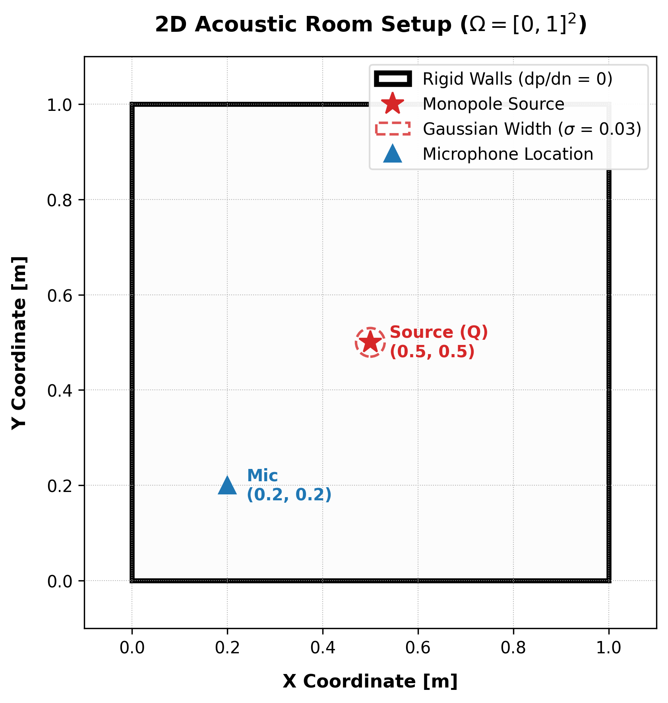
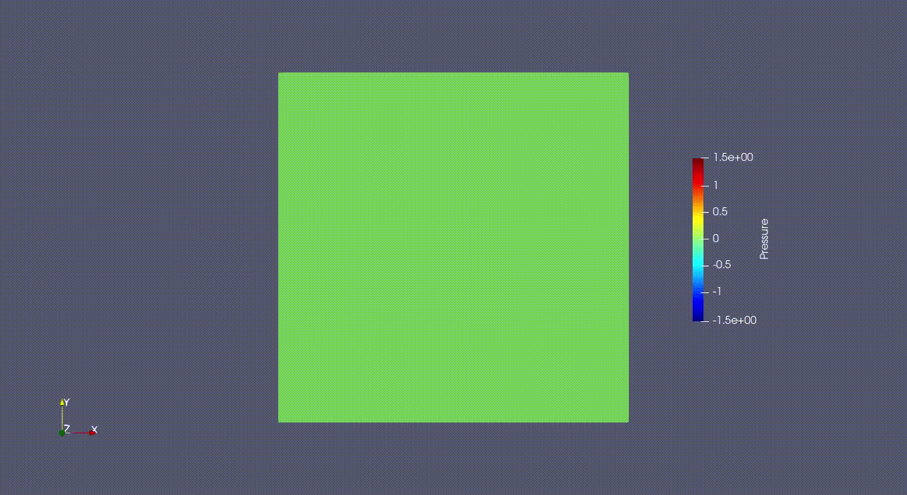
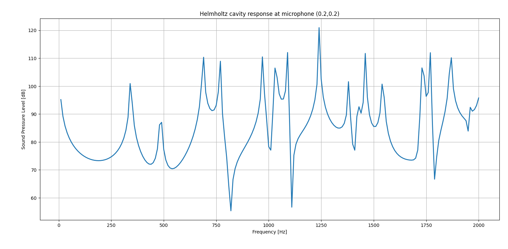
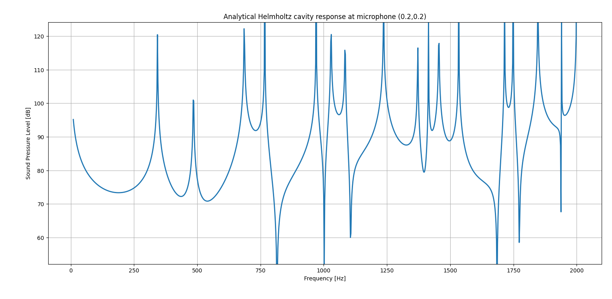

# Helmholtz Equation: Monopole source inside a 2D Room

## Helmholtz


We will solve the forced acoustic response of a rigid rectangular cavity. We will solve the inhomogeneous Helmholtz Equation over the unit square.

$$
\Omega = [0,1]^2
$$



## From the Time Domain to the Frequency Domain

Acoustic wave propagation is fundamentally governed by the time-domain inhomogeneous wave equation. For a monopole (volume injection) source:

$$
\frac{1}{c^2} \frac{\partial^2 p}{\partial t^2} - \Delta p = \rho_0 \frac{\partial q}{\partial t}
$$

Where:
* $p(x,y,t)$ is the acoustic pressure.
* $q(x,y,t)$ is the volume velocity source density, representing the rate at which the source injects or removes fluid per unit volume.
* $c$ is the speed of sound.
* $\rho_0$ is the ambient fluid density.

We apply the **time-harmonic assumption**. We separate the spatial variables from the time variable by expressing pressure and source as complex phasors oscillating at an angular frequency $\omega$:

$$
p(x,y,t) = \tilde{p}(x,y) e^{j\omega t}
$$

$$
q(x,y,t) = \tilde{q}(x,y) e^{j\omega t}
$$

By substituting these phasors into the wave equation:
* The first time derivative of the source gives: $\frac{\partial q}{\partial t} = j\omega \tilde{q} e^{j\omega t}$
* The second time derivative of the pressure: $\frac{\partial^2 p}{\partial t^2} = -\omega^2 \tilde{p} e^{j\omega t}$

Substituting these back into the wave equation yields:

$$
-\frac{\omega^2}{c^2} \tilde{p} e^{j\omega t} - \Delta \tilde{p} e^{j\omega t} = j\omega \rho_0 \tilde{q} e^{j\omega t}
$$

We then divide out the common $e^{j\omega t}$ term. By introducing the wavenumber $k = \omega/c$, we substitute $\frac{\omega^2}{c^2}$ with $k^2$, leaving us with a purely spatial partial differential equation. Rearranging the signs gives us the standard Helmholtz equation.


---

## Governing equations

The strong form:

$$
\Delta \tilde{p} + k^2 \tilde{p} = -j \omega \rho_0 \tilde{q} \quad \text{in } \Omega
$$

With natural boundary conditions:

$$
\frac{\partial \tilde{p}}{\partial n} = 0 \quad \text{on } \Gamma
$$


---

## Weak formulation

To derive the weak form, we multiply the strong form by the complex conjugate of a test function $\bar{v}$, where $v \in H^1(\Omega, \mathbb{C})$, and integrate over the domain $\Omega$:

$$
\int_\Omega \bar{v} (\Delta \tilde{p} + k^2 \tilde{p}) \, d\Omega = \int_\Omega \bar{v} (-j \omega \rho_0 \tilde{q}) \, d\Omega
$$

We apply Green's first identity (integration by parts) to the Laplacian term:

$$
\int_\Omega \bar{v} \Delta \tilde{p} \, d\Omega = \int_\Gamma \bar{v} \frac{\partial \tilde{p}}{\partial n} \, d\Gamma - \int_\Omega \nabla \tilde{p} \cdot \nabla \bar{v} \, d\Omega
$$

Because our boundaries represent perfectly rigid walls, we apply the natural Neumann boundary condition ($\frac{\partial \tilde{p}}{\partial n} = 0$). The boundary integral on $\Gamma$ evaluates to zero, leaving:

$$
-\int_\Omega \nabla \tilde{p} \cdot \nabla \bar{v} \, d\Omega + \int_\Omega k^2 \tilde{p} \bar{v} \, d\Omega = - \int_\Omega j \omega \rho_0 \tilde{q} \bar{v} \, d\Omega
$$

To match standard stiffness matrix conventions (where the diffusion term is positive), we multiply the entire equation by $-1$:

$$
\int_\Omega \nabla \tilde{p} \cdot \nabla \bar{v} \, d\Omega - \int_\Omega k^2 \tilde{p} \bar{v} \, d\Omega = \int_\Omega j \omega \rho_0 \tilde{q} \bar{v} \, d\Omega
$$

We define the complex $L^2(\Omega)$ inner product (a sesquilinear form) as:

$$
(u, v) := \int_\Omega u \cdot \bar{v} \, d \Omega
$$

Using this notation, the standard complex weak formulation becomes: find $\tilde{p} \in V_h \subset H^1(\Omega, \mathbb{C})$ such that:

$$
(\nabla \tilde{p}, \nabla v) - (k^2 \tilde{p}, v) = (j \omega \rho_0 \tilde{q}, v) \quad \forall v \in V_h
$$

---

## Real and Imaginary Split (Mixed Formulation)

Since our solver relies heavily on AD through Dual Numbers and for now it doesn't actually support Complex Numbers, we will do a little trick to be able to solve this problem. To solve this complex-valued PDE, we decompose the pressure, test function, and source into their real and imaginary parts:
* $\tilde{p} = p_r + j p_i$
* $v = v_r + j v_i$
* $\tilde{q} = q$ (Assuming our spatial source distribution is purely real)

By substituting these into the complex weak form and separating the real and imaginary components, we obtain a coupled system of two purely real equations.

**1. Real Equation:**
$$
(\nabla p_r, \nabla v_r) - (k^2 p_r, v_r) = 0
$$

**2. Imaginary Equation:**
$$
(\nabla p_i, \nabla v_i) - (k^2 p_i, v_i) = (\omega \rho_0 q, v_i)
$$

This translates to assembling two independent residual blocks ($R_r$ and $R_i$) within a mixed function space.

---

## Discretization

- **Mesh type:** Structured 2D Grid
- **Element:** Bilinear Quadrilateral (Quad4)
- **Function space:** Mixed Space $V_h = [V_r, V_i]$ where $V_r, V_i \subset H^1(\Omega)$

Approximation for each scalar component:

$$
u_h = \sum_{i=1}^{N_{dof}} U_i \phi_i
$$

---

## Implementation details
The full file implementation will be on [example_helmholtz.py](./example_helmholtz.py)


We begin our file with the needed imports:
```python
import numpy as np

from fem_engine.mesh import create_rectangle_mesh, FunctionSpace, MixedFunctionSpace
from fem_engine.element import Quad4
from fem_engine.assembler import MixedAssembler
from fem_engine.fem_solver import solve_newton_raphson
from fem_engine.postprocess import export_vtu, evaluate_field_at_point
```

We will solve this problem for a frequency range from ```10 to 2 kHz```. At first, though, we will solve it only for a single frequency ```500 Hz```.

Our problem will have a point source at ```(0.5,0.5)```, $\tilde{q} = Q \delta(\mathbf{x}-\mathbf{x_0})$ and we will also evaluate the value of the Sound Pressure Level (SPL) at ```(0.2,0.2)```.

In order to compare the results, we will have the analytical solution, which can be derived using an **eigenfunction (modal) expansion**. 

For a 2D rectangular room of dimensions $L \times W$ with rigid walls, the exact complex acoustic pressure at any receiver location $(x, y)$ excited by a point source at $(x_s, y_s)$ is expressed as an infinite sum of the cavity's natural modes:

$$p(x,y) = j \omega \rho_0 Q \sum_{m=0}^{\infty} \sum_{n=0}^{\infty} \frac{\psi_{mn}(x,y) \psi_{mn}(x_s,y_s)}{K_{mn} (k_{mn}^2 - k^2)}$$

Where:
* **Eigenfunctions (Mode shapes):** $\psi_{mn}(x,y) = \cos\left(\frac{m\pi x}{L}\right) \cos\left(\frac{n\pi y}{W}\right)$
* **Eigenvalues (Resonance wave-numbers):** $k_{mn}^2 = \left(\frac{m\pi}{L}\right)^2 + \left(\frac{n\pi}{W}\right)^2$
* **Normalization constant:** $K_{mn} = \frac{L W}{\epsilon_m \epsilon_n}$ (with $\epsilon_0 = 1$, and $\epsilon_m = 2$ for $m > 0$)


Because the analytical formula is an infinite series, we can truncate the sum at a sufficiently high number of modes (e.g., `n_modes = 30`) to achieve a highly accurate benchmark.

We will define the physical parameters for our problem

```python
# Physical parameters
L = 1.0
W = 1.0

c = 343.0
rho0 = 1.225

frequency = 500.0 # Hz
omega = 2.0 * np.pi * frequency
k = omega / c
```

In the analytical solution, the point source is modeled as a Dirac delta function. In FEM, however, this is not possible: a Dirac delta isn't even in $L^2$ or $H^{-1}$. To bypass it, we will use a Gaussian function.

$$
q(x,y) = \frac{1}{2\pi\sigma^2} \exp\left( -\frac{(x - 0.5)^2 + (y - 0.5)^2}{2\sigma^2} \right)
$$

Where:
* $\sigma$ is the spatial width (standard deviation) of the source.
* $(0.5, 0.5)$ is the central coordinate of our monopole.

We use $\frac{1}{2\pi\sigma^2}$ because it represents the exact normalization constant for a 2D Gaussian distribution, which guarantees that the total volume integral over the space equals exactly $1$:

$$\iint_{\Omega} q(x,y) \,dx\,dy \approx 1$$

By enforcing this, we ensure that when the source distribution is multiplied by our target volume velocity $Q$ in the weak form, the exact same total acoustic mass is injected into the room as the analytical point source. This provides a smooth, continuous field that our finite element mesh can actually resolve and integrate cleanly.

We implement this regularized monopole source with a width of $\sigma = 0.03$:

```python
# Gaussian monopole Source
def q_source(x, y):
    sigma = 0.03 # Gaussian width
    r2 = (x - 0.5)**2 + (y - 0.5)**2
    amplitude = 1.0 / (2.0 * np.pi * sigma**2)

    return amplitude * np.exp(-r2 / (2.0 * sigma**2))
```

Now we will define our weak form, in a mixed way to bypass the complex restriction. We also set our source amplitude to $0.0005$ 

```python
def helmholtz_weak(mapped, pos_gp, e):

    (N_r, B_r, p_r, grad_pr) = mapped[0]
    (N_i, B_i, p_i, grad_pi) = mapped[1]

    x, y = pos_gp

    q = 0.0005 * q_source(x, y)

    # Real part
    # lap(pr) + k^2 pr = 0

    stiffness_r = B_r.T @ grad_pr
    mass_r  = -np.outer(N_r, k**2 * p_r)

    R_r = stiffness_r + mass_r

    # Imaginary part
    # lap(pi) + k^2 pi = -omega * rho * Q

    stiffness_i = B_i.T @ grad_pi
    mass_i  = -np.outer(N_i, k**2 * p_i)

    source = -np.outer(N_i, omega * rho0 * q)

    R_i = stiffness_i + mass_i + source

    return [R_r, R_i]
```

We then go to the main part and solve the problem:

```python
    mesh = create_rectangle_mesh(L=L,W=W,n_x=60,n_y=60,x0=0.0,y0=0.0)

    V_r = FunctionSpace(mesh, Quad4(), n_components=1)
    V_i = FunctionSpace(mesh, Quad4(), n_components=1)

    V = MixedFunctionSpace([V_r, V_i])

    assembler = MixedAssembler(V, helmholtz_weak, quad_degree=2)

    # Rigid walls:
    # del p/del n = 0
    # This is the natural BC of the weak form,
    # therefore NO boundary conditions are applied.

    def apply_bcs(R, K, U):
        return R, K

    U0 = np.zeros(V.ndofs)

    U = solve_newton_raphson(U0, assembler.assemble, apply_bcs)
```

We then start postprocessing the results. We will evaluate the Sound Pressure Level at $(0.2,0.2)$

```python
    p_real, p_imag = V.split(U)

    # Microphone location

    mic = np.array([0.2,0.2])

    # Microphone evaluation

    Pr = evaluate_field_at_point(mesh, V_r, p_real, mic)
    Pi = evaluate_field_at_point(mesh, V_i, p_imag, mic)

    # remove possible array wrapping

    Pr = Pr[0] if np.ndim(Pr)>0 else Pr
    Pi = Pi[0] if np.ndim(Pi)>0 else Pi

    # complex magnitude

    Pmag = np.sqrt(Pr**2 + Pi**2)

    print("SPL at mic location is")
    pref = 2e-5
    spl = 20*np.log10(Pmag/pref)
    print(spl)
```
```
SPL at mic location is
77.38794830137493
```


And the analytical solution is:
```
Analytical SPL at 500.0 Hz: 77.60 dB
```

We will now solve it from  ```10 Hz``` to ```2 kHz```
The full file implementation will be on [example_helmholtz_freqsweep.py](./example_helmholtz_freqsweep.py), we will solve now the problem in a linear form as we did for poisson.

Solving it gives us:



Meanwhile the analytical one


