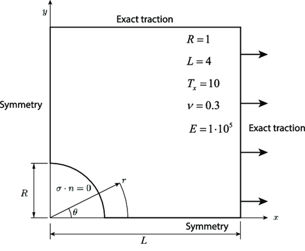
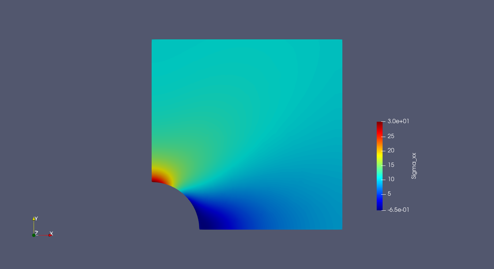
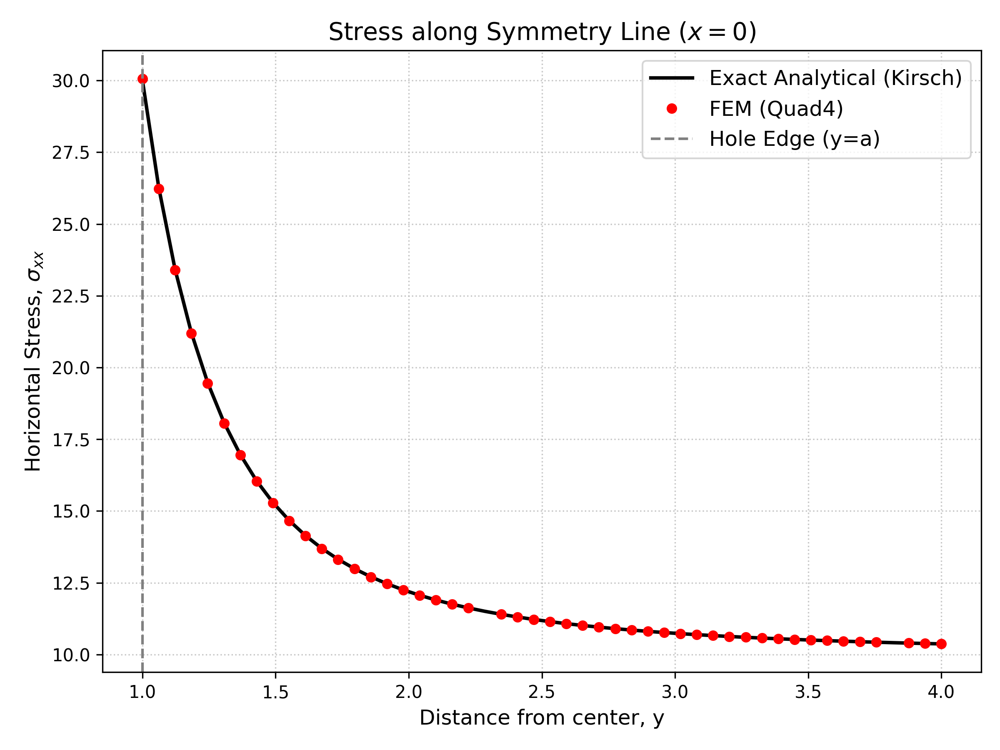

# <Problem Name>

## Kirsch Infinite Plate

We will solve a very known linear elasticity problem:

The infinite plate with a circular hole under constant in-plane tension

The problem definition is: 



Due to the problem symmetry we will only model the top right corner of it.

---

## Governing equations

The strong form:

$$
-\nabla \cdot \sigma(u) = f \quad \text{in } \Omega
$$

$$
u = g \quad \text{on } \Gamma_D
$$

$$
\sigma n = t \quad \text{on } \Gamma_N
$$

With

$$
\epsilon(u) = \frac{1}{2} (\nabla u + (\nabla u)^T)
$$

and with

$$
\sigma(u) = \lambda \ tr(\epsilon(u))I + 2 \mu \epsilon(u)
$$

tr being the trace operator of a tensor, I the identity

---

##  Weak formulation

After multiplying by a test function and integrating by parts:

$$
\int_\Omega  \sigma : \nabla v \, d\Omega = \int_\Omega f \cdot v \ d\Omega \ + \int_{\Gamma_N} t \ d \Gamma
$$

This formulation is the same as the more usual one:

$$
\int_\Omega  \sigma : \epsilon(v) \, d\Omega  = \int_\Omega f \cdot v \ d\Omega  + \int_{\Gamma_N} t \ d \Gamma
$$

---

## Discretization

- Mesh type: unstructured
- Element: Quad4
- Function space:
  - $V_h \subset H^1$

Approximation:

$$
u_h = \sum_i U_i \phi_i
$$

---

## Implementation details
The full file implemenation will be on [example_kirsch_plate.py](./example_kirsch_plate.py)


We begin our file with the needed imports:
```python
import numpy as np
import gmsh
import os
import time

from fem_engine.external_mesh import import_mesh
from fem_engine.mesh import FunctionSpace
from fem_engine.bcs import DirichletBC, NeumannBC
from fem_engine.assembler import Assembler
from fem_engine.fem_solver import solve_newton_raphson
from fem_engine.element import Quad4
from fem_engine.postprocess import export_vtu, average_at_nodes, evaluate_field_at_point
```

With the input traction, our reference solution will be $$\sigma_{xx} = 30.0  $$ at the tip of our plate.

We begin by defining the parameters of our problem

```python
E = 1e5
nu = 0.3
lambda_ = E * nu / (1 - nu**2)
mu = E / (2 * (1 + nu))

L = 4.0 
W = 4.0
a = 1.0
T_inf = 10.0 # Far-field load
```

For the boundary traction applied, we'll make use of kirsch solutions [themselves](https://en.wikipedia.org/wiki/Kirsch_equations), (note we had to bring them to cartesian coordinates)

```python
def kirsch_stress_tensor(x, y, T, a):
    """Returns the exact analytical 2D Cauchy stress tensor at (x, y)."""
    r = np.sqrt(x**2 + y**2) + 1e-15
    theta = np.arctan2(y, x)
    
    sig_r = (T / 2) * (1 - a**2 / r**2) + (T / 2) * (1 - 4*a**2 / r**2 + 3*a**4 / r**4) * np.cos(2*theta)
    sig_t = (T / 2) * (1 + a**2 / r**2) - (T / 2) * (1 + 3*a**4 / r**4) * np.cos(2*theta)
    tau_rt = -(T / 2) * (1 + 2*a**2 / r**2 - 3*a**4 / r**4) * np.sin(2*theta)
    
    c, s = np.cos(theta), np.sin(theta)
    sig_x = sig_r * c**2 + sig_t * s**2 - 2 * tau_rt * s * c
    sig_y = sig_r * s**2 + sig_t * c**2 + 2 * tau_rt * s * c
    tau_xy = (sig_r - sig_t) * s * c + tau_rt * (c**2 - s**2)
    
    return np.array([
        [sig_x, tau_xy], 
        [tau_xy, sig_y]
    ])
```

Then we define the traction for the boundaries

```python
def traction_right_edge(x, y):
    """Traction on x=L boundary. Normal vector n = [1, 0]. T = Sigma * n"""
    sigma = kirsch_stress_tensor(x, y, T_inf, a)
    return [sigma[0, 0], sigma[1, 0]]  # [sig_xx, tau_xy]

def traction_top_edge(x, y):
    """Traction on y=W boundary. Normal vector n = [0, 1]. T = Sigma * n"""
    sigma = kirsch_stress_tensor(x, y, T_inf, a)
    return [sigma[0, 1], sigma[1, 1]]  # [tau_xy, sig_yy]
```

We now generate a mesh for our problem, a bilinear quad mesh:
(It doesn't actually matter how gmsh generates it... as long as it gives a 4 node case for this case)

```python
def generate_quarter_plate_hole(filename, lc_far=0.4, lc_hole=0.015):
    gmsh.initialize()
    gmsh.option.setNumber("General.Terminal", 0)
    gmsh.model.add("PlateHoleExact")

    rect = gmsh.model.occ.addRectangle(0, 0, 0, L, W)
    disk = gmsh.model.occ.addDisk(0, 0, 0, a, a)
    out, _ = gmsh.model.occ.cut([(2, rect)], [(2, disk)])
    gmsh.model.occ.synchronize()

    gmsh.model.mesh.field.add("MathEval", 1)
    gmsh.model.mesh.field.setString(1, "F", f"{lc_hole} + ({lc_far} - {lc_hole}) * (sqrt(x*x + y*y) - {a}) / {L * 1.414 - a}")
    gmsh.model.mesh.field.setAsBackgroundMesh(1)

    gmsh.option.setNumber("Mesh.MeshSizeExtendFromBoundary", 0)
    gmsh.option.setNumber("Mesh.MeshSizeFromPoints", 0)
    gmsh.option.setNumber("Mesh.MeshSizeFromCurvature", 0)

    gmsh.option.setNumber("Mesh.Algorithm", 8)
    gmsh.option.setNumber("Mesh.RecombinationAlgorithm", 2)
    
    for dim, tag in out:
        if dim == 2:
            gmsh.model.mesh.setRecombine(2, tag)
            
    gmsh.option.setNumber("Mesh.SubdivisionAlgorithm", 1)
    gmsh.model.mesh.generate(2)
    gmsh.write(filename)
    gmsh.finalize()
```

We finally define our weak form

```python
def linear_elasticity(N, B_x, u_gp, grad_u, x_gp, e):
    eps = 0.5 * (grad_u + grad_u.T)
    tr_eps = eps[0,0] + eps[1,1]
    
    sigma = np.zeros((2, 2), dtype=grad_u.dtype)
    sigma[0,0] = lambda_ * tr_eps + 2 * mu * eps[0,0]
    sigma[1,1] = lambda_ * tr_eps + 2 * mu * eps[1,1]
    sigma[0,1] = 2 * mu * eps[0,1]
    sigma[1,0] = 2 * mu * eps[1,0]
    
    return B_x.T @ sigma
```

And a helper function to plot the $\sigma_{xx}$ later
(we could generate all elements of our stress tensor... and export them as well)

```python
def compute_sigma_xx(u_gp, grad_u):
    eps = 0.5 * (grad_u + grad_u.T)
    tr_eps = eps[0,0] + eps[1,1]
    return lambda_ * tr_eps + 2 * mu * eps[0,0]
```

Now onto the main part, we generate our mesh with the function we defined AND import it to our internal format with ```import_mesh```

```python
msh_file = "results/plate_hole_exact.msh"
generate_quarter_plate_hole(msh_file)
mesh = import_mesh(msh_file, element_type="quad")
```

As usual, let's define the spaces and elements, and our assembler

```python
V = FunctionSpace(mesh, Quad4(), n_components=2)
assembler_el = Assembler(V, linear_elasticity, quad_degree=2)
```

Our tractions are applied through the exact solution provided. We also apply the Dirichlet boundary conditions.

```python
def apply_bcs(R, K, U):
        tol = 1e-5
        
        # Neumann BCs
        bcs_neumann = [
            NeumannBC(V, load_vector=traction_right_edge, boundary_marker_func=lambda x, y: x > L - tol),
            NeumannBC(V, load_vector=traction_top_edge, boundary_marker_func=lambda x, y: y > W - tol)
        ]
        
        for bc in bcs_neumann:
            R, K = bc.apply(R, K, U)
            
        # Symmetry Dirichlet BCs
        bcs_dirichlet = [
            DirichletBC(V, value=0.0, boundary_marker_func=lambda x, y: x < tol, component=0),
            DirichletBC(V, value=0.0, boundary_marker_func=lambda x, y: y < tol, component=1)
        ]
        
        for bc in bcs_dirichlet: 
            R, K = bc.apply(R, K, U)
            
        return R, K
```

We then solve and export the values of the stress with the function ```average_at_nodes```, which will average the values of the stress at nodes so the visualization of it will be "nicer" and continuous (although it isn't really)

```python
U_final = solve_newton_raphson(np.zeros(V.ndofs), assembler_el.assemble, apply_bcs)

V_stress_node, U_stress_node = average_at_nodes(V, U_final, compute_sigma_xx, n_components=1)
```

To compare it at the tip of our reference solution, there is a function called ```evaluate_field_at_point```, which will perform a few newton iterations to solve the problem: given x,y coordinates, evaluate the solution. This is an inverse problem, because we usually go from reference coordinates -> physical. For nodal FEM we can just locate the dofs at the physical points, but still.

```python
sigma_xx_tip = evaluate_field_at_point(mesh, V_stress_node, U_stress_node, target_pt)
    
exact_tensor_tip = kirsch_stress_tensor(0.0, a, T_inf, a)
sigma_xx_analytical_tip = exact_tensor_tip[0, 0]

print(f"Applied Far-Field Kirsch Tensor : {T_inf:.2f}")
print(f"Peak Stress at Tip : {sigma_xx_tip[0]:.2f}")
print(f"Analytical sigma_xx at tip : {sigma_xx_analytical_tip:.6f}")
```

Which gives

```
Applied Far-Field Kirsch Tensor : 10.00
Peak Stress at Tip : 30.06
Analytical sigma_xx at tip : 30.000000
```

With the values of the stress calculated with the helper function, we can export it as a vtu file, alongside the displacements

```python
export_vtu(V, U_final, "results/plate_hole_disp.vtu", field_name="Displacement")
export_vtu(V_stress_node, U_stress_node, "results/plate_hole_sigmaxx.vtu", field_name="Sigma_xx")
```





