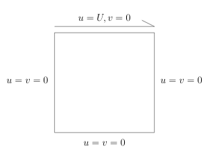
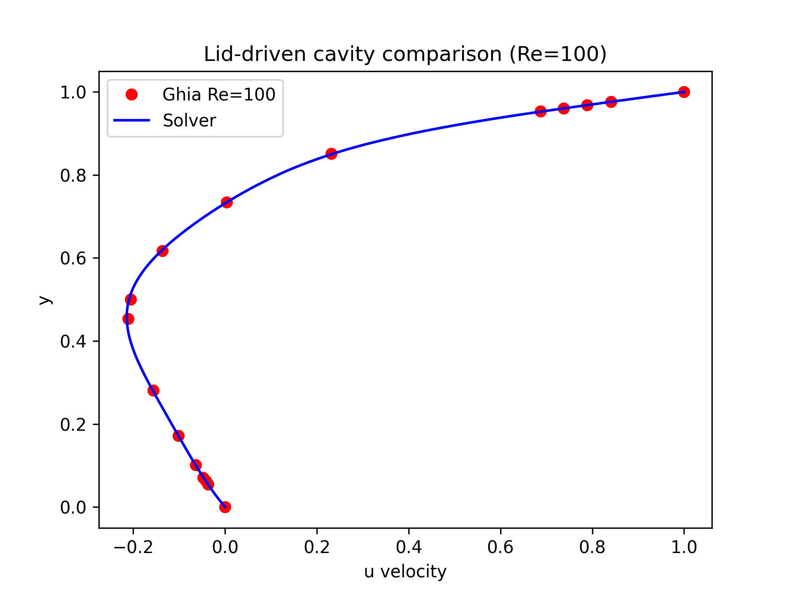
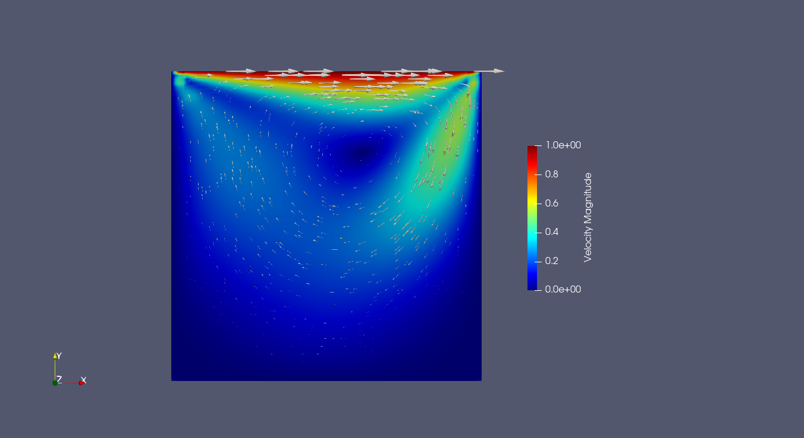

# <Problem Name>

## Lid Driven Cavity

We will solve the famous lid driven cavity problem:

The problem definition is: 



The characteristic velocity is

$$
U = 1.
$$

---

## Governing equations

The strong form:

The **non-dimensional, steady incompressible Navier–Stokes equations**.

$$
(\mathbf{u}\cdot\nabla)\mathbf{u} = -\nabla p + \frac{1}{Re}\Delta\mathbf{u}
\qquad \text{in } \Omega
$$

$$
\nabla\cdot\mathbf{u} = 0 \qquad \text{in } \Omega
$$

where

$$
Re = 100.
$$

### Boundary Conditions

Moving lid:

$$
\mathbf{u}=(1,0)
\qquad \text{on the top edge}
$$

No-slip walls:

$$
\mathbf{u}=(0,0)
\qquad \text{on the left, right, and bottom edges}
$$

To remove the pressure null space, one pressure degree of freedom is fixed (otherwise pressure is determined up to a constant)

$$
p(0,0)=0.
$$

---

##  Weak formulation

We seek $(\mathbf{u}, p) \in V \times Q$ such that $\mathbf{u}$ satisfies the Dirichlet boundary conditions

Let the test functions be:
- $\mathbf{v} \in V$
- $q \in Q$

After multiplying by test functions and integrating the viscous term by parts, the weak formulation becomes

---

### Weak Form

Find $(\mathbf{u}, p)$ such that:

$$
\frac{1}{Re} \int_\Omega \nabla \mathbf{u} : \nabla \mathbf{v}\, d\Omega + \int_\Omega (\mathbf{u} \cdot \nabla)\mathbf{u} \cdot \mathbf{v}\, d\Omega - \int_\Omega p (\nabla \cdot \mathbf{v})\, d\Omega = 0
$$

for all $\mathbf{v} \in V$, and

$$
\int_\Omega q (\nabla \cdot \mathbf{u})\, d\Omega
= 0
$$

for all $q \in Q$.

The choice of (V,Q) is  not arbitrary. We know from theory that this is a saddle-point problem; therefore, the velocity and pressure spaces must satisfy the Ladyzhenskaya–Babuska–Brezzi (inf-sup) condition. A standard stable choice is the Taylor–Hood element pair, which is employed here.

---

## Discretization


- Mesh type: structured quadrilateral mesh of the unit square $\Omega = (0,1)\times(0,1)$
- Element type:
  - Velocity: Q2 (biquadratic quadrilateral)
  - Pressure: Q1 (bilinear quadrilateral)
  - Taylor–Hood mixed element pair

- Function spaces:
  - $\mathbf{V}_h \subset [H^1(\Omega)]^2$ (velocity space)
  - $Q_h \subset L^2(\Omega)$ (pressure space)

- Mixed space:
$$(\mathbf{u}_h, p_h) \in \mathbf{V}_h \times Q_h$$

---

## Implementation details
The full file implementation will be on [example_lid_driven_cavity.py](./example_lid_driven_cavity.py)


We begin our file with the needed imports:
```python
import numpy as np

from fem_engine.mesh import create_quadratic_rectangle_mesh, create_rectangle_mesh, FunctionSpace, MixedFunctionSpace
from fem_engine.element import Quad9, Quad4
from fem_engine.assembler import MixedAssembler
from fem_engine.bcs import DirichletBC
from fem_engine.fem_solver import solve_newton_raphson
from fem_engine.postprocess import export_vtu, evaluate_field_at_point
```

We define our mesh: (Note: it could be a Quad4 mesh as well...)

```python
L, W = 1.0, 1.0
elements_x, elements_y = 20, 20  # Increased resolution

mesh = create_quadratic_rectangle_mesh(L, W, n_x=elements_x, n_y=elements_y, x0=0.0, y0=0.0)
```

We then define our Function Spaces

```python
V_u = FunctionSpace(mesh, Quad9(), n_components=2)  
V_p = FunctionSpace(mesh, Quad4(), n_components=1) 
```

Now, since our problem is a mixed problem, ie, we are solving for more than 1 unknown, we must put them together

```python
# For a Mixed Space this is the usual way we'll combine things
V = MixedFunctionSpace([V_u, V_p])
```

And we finally define our weak form. 

**For Mixed Problems the arguments change a bit (but not really): mapped will be a list that in each dimension will recover what we have available (N, B, u, grad_u) for our fields to define the weak form**

```python
def navier_stokes_weak_form(mapped, gp, e):
    (N_u, B_u, u, grad_u) = mapped[0]
    (N_p, B_p, p, grad_p) = mapped[1]

    # Because U=1.0 and L=1.0, Re = 1/nu. 
    # Let's set Re = 100 for the benchmark
    Re = 100.0
    nu = 1.0 / Re

    # 1. Viscous term
    visc = nu * (B_u.T @ grad_u)   # (9,2)

    # 2. Pressure gradient
    # the [0] is mostly due to issues with numpy broadcasting and the Dual class... something to fix in the future
    p_val = p[0]
    
    p_div_v = np.zeros_like(visc)
    for i in range(len(N_u)):
        p_div_v[i, 0] = B_u[0, i] * p_val
        p_div_v[i, 1] = B_u[1, i] * p_val
    
    # Can be just: p_div_v = B_u.T * p_val

    # 3. Non-linear Advection term: (u . nabla) u
    # 'u' is (2,), 'grad_u' is (2,2). 
    # 'u @ grad_u' gives the convective acceleration vector (2,)
    # np.outer distributes it to the 9 nodes -> (9,2)
    advection = np.outer(N_u, u @ grad_u)

    # Momentum residual
    R_u = visc - p_div_v + advection

    # 4. Continuity equation
    div_u = grad_u[0, 0] + grad_u[1, 1]
    
    R_p = -np.outer(N_p, [div_u])

    return [R_u, R_p]
```

We assemble it

```python
assembler = MixedAssembler(V, navier_stokes_weak_form, quad_degree=3)
```

And we define our boundary conditions (we fixed one boundary dof for the pressure, otherwise we wouldn't be able to solve it)

**Important: for mixed problems we must define an "offset" for the application of boundary conditions. That is, since our system is built by stacking the fields, for the second unknown we must "offset" it by the number of dofs of the previous field**

```python
def left_wall(x, y): return abs(x) < 1e-6
def right_wall(x, y): return abs(x - L) < 1e-6
def top_wall(x, y): return abs(y - W) < 1e-6
def bottom_wall(x, y): return abs(y) < 1e-6

def apply_bcs(R, K, U):
    offset_u = 0
    offset_p = V_u.ndofs

    # Lid-driven cavity:
    # top: u = (1,0)
    bc_top_x = DirichletBC(V_u, value=1.0, boundary_marker_func=top_wall, component=0)
    bc_top_y = DirichletBC(V_u, value=0.0, boundary_marker_func=top_wall, component=1)

    # no-slip elsewhere
    bc_zero_x = DirichletBC(V_u, value=0.0, boundary_marker_func=lambda x,y: left_wall(x,y) or right_wall(x,y) or bottom_wall(x,y), component=0)
    bc_zero_y = DirichletBC(V_u, value=0.0, boundary_marker_func=lambda x,y: left_wall(x,y) or right_wall(x,y) or bottom_wall(x,y), component=1)

    for bc in [bc_top_x, bc_top_y, bc_zero_x, bc_zero_y]:
        R, K = bc.apply(R, K, U, offset=offset_u)

    # pressure fix (otherwise it is defined only up to a constant)
    bc_p = DirichletBC(V_p, value=0.0, boundary_marker_func=lambda x,y: abs(x)<1e-6 and abs(y)<1e-6)
    R, K = bc_p.apply(R, K, U, offset=offset_p)

    return R, K
```

We then solve the problem

```python
U0 = np.zeros(V.ndofs)

U_sol = solve_newton_raphson(U0, assembler.assemble, apply_bcs)
```

Ghia et al. ([1982](#references)) gives us tabulated results for different Reynolds numbers, since we solve with Re=100.0 we will use the values related to it and plot the results through the geometric center of the cavity.

```python
U_u, U_p = V.split(U_sol)

export_vtu(V_u, U_u, "results/velocity_cavity.vtu", field_name="Velocity", n_vis_pts=5)
export_vtu(V_p, U_p, "results/pressure_cavity.vtu", field_name="Pressure")

ghia_y = np.array([
    1.0000,
    0.9766,
    0.9688,
    0.9609,
    0.9531,
    0.8516,
    0.7344,
    0.6172,
    0.5000,
    0.4531,
    0.2813,
    0.1719,
    0.1016,
    0.0703,
    0.0625,
    0.0547,
    0.0000
])

u_sim = []

for y in ghia_y:
    val = evaluate_field_at_point(mesh, V_u, U_u, np.array([0.5, y]))
    u_sim.append(val[0]) # x-velocity

print("Top point:", u_sim[0], "should be ~1.0")


ghia_u_100 = np.array([
    1.00000,
    0.84123,
    0.78871,
    0.73722,
    0.68717,
    0.23151,
    0.00332,
    -0.13641,
    -0.20581,
    -0.21090,
    -0.15662,
    -0.10150,
    -0.06434,
    -0.04775,
    -0.04192,
    -0.03717,
    0.00000
])

y_fine = np.linspace(0, 1, 200)
u_fine = []

for y in y_fine:
    val = evaluate_field_at_point(mesh, V_u, U_u, np.array([0.5, y]))
    u_fine.append(val[0])

u_fine = np.array(u_fine)

plt.plot(ghia_u_100, ghia_y, 'ro', label="Ghia Re=100")
plt.plot(u_fine, y_fine, 'b-', label="Solver")

plt.xlabel("u velocity")
plt.ylabel("y")
plt.legend()
plt.gca()
plt.title("Lid-driven cavity comparison (Re=100)")
plt.show()


u_sim = np.array(u_sim)
ghia = ghia_u_100

err = u_sim - ghia

eps = 1e-12
percent_error = 100.0 * err / (np.abs(ghia) + eps)
```

```
L2 relative error: 0.5730383580088722 %
```






## References

1. Ghia, U., Ghia, K. N., & Shin, C. T. (1982).
   *High-Re solutions for incompressible flow using the Navier-Stokes equations and a multigrid method.*
   Journal of Computational Physics, 48(3), 387–411.
   https://doi.org/10.1016/0021-9991(82)90058-4