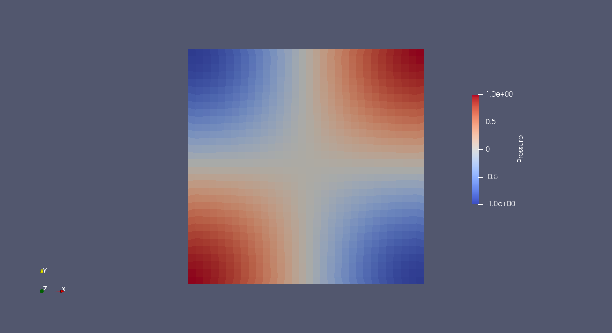
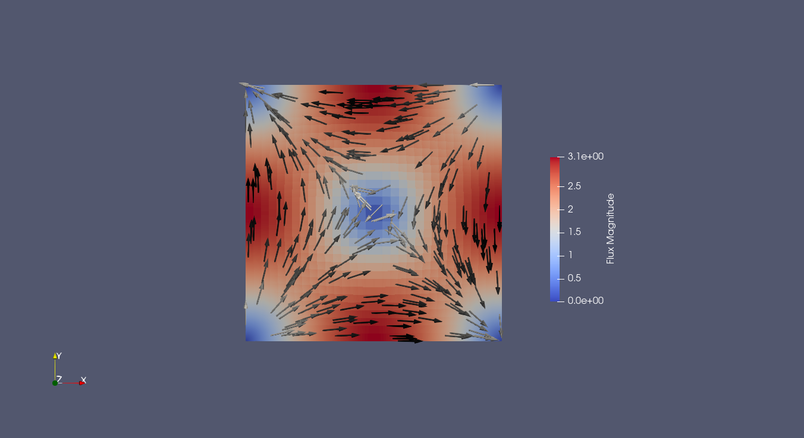

# Mixed Poisson Method with Raviart–Thomas Elements

## Mixed Poisson

Instead of solving the poisson equation in the usual way, we introduce a new variable $$\mathbf{q} = -\nabla u$$

---

## Governing equations

The strong form:


$$
\mathbf{q} + \nabla u = 0 \qquad \text{in } \Omega
$$

$$
\nabla\cdot\mathbf{q} = f \qquad \text{in } \Omega
$$

and

### Boundary Conditions

$$
\mathbf{q} \cdot \mathbf{n} = g \qquad \text{on } \partial \Omega
$$

for the boundary condition. Now, due do it being a mixed formulation, the above boundary condition is an **essential** boundary condition (should be effectively enforced in our function space)

As for the source we will set

$$
f = 2  \pi^2 cos(\pi x) cos(\pi y)
$$

and $g = 0 $

Our domain will be the unit square $$\Omega = [0,1]^2$$

---

##  Weak formulation
The flux space requires square-integrable divergence

$$
\mathbf{H}(div, \Omega) = \{\mathbf{v} \in [L^2(\Omega)]^2 \mid \nabla \cdot \mathbf{v} \in L^2(\Omega) \}
$$

while the other space for u requires it only being in $$L^2(\Omega)$$

And since we must enforce our boundary condition we will denote the spaces for q and u as

$$
\mathbf{V_q} = \{\mathbf{v} \in \mathbf{H}(div, \Omega) \mid \mathbf{v} \cdot \mathbf{n} = g \quad \text{on } \partial \Omega \}
$$

and for u

$$
V_u = L^2(\Omega)
$$

---

### Weak Form

After integrating by parts the applicable terms, we end up with

Find $(\mathbf{q}, u) \in \mathbf{V_q} \times V_u$ such that the following holds

$$
(\mathbf{q}, \mathbf{v}) - (u, \nabla \cdot \mathbf{v}) = 0 \quad \forall \mathbf{v} \in \mathbf{V_q}
$$

$$
(\nabla \cdot \mathbf{q}, w) - (f, w) = 0 \quad \forall w \in V_u
$$

The choice of the spaces is not arbitrary, for this example we will use the lowest order Raviart-Thomas for $H(div)$ , while a simple discontinuous Lagrange element for $u$. This is a stable pair for our problem.

**A note on naming and notation.** 

The lowest-order quadrilateral Raviart–Thomas element is constructed with `QuadRT0()`. Depending on the literature, this naming may seem counterintuitive: for quadrilateral elements, we use the classical tensor-product definition of the Raviart–Thomas family, $RT_k = Q_{k+1,k} \times Q_{k,k+1}$, where $Q_{m,n}$ denotes the space of polynomials of degree at most $m$ in the first coordinate and at most $n$ in the second. Consequently, `QuadRT0()` corresponds to the space $RT_0 = Q_{1,0} \times Q_{0,1}$, which is the lowest-order Raviart–Thomas element on quadrilaterals.

---

## Discretization

- Mesh type: structured quadrilateral mesh of the unit square $\Omega = [0,1]\times[0,1]$
- Element type:
  - Flux: RT0 (lowest-order Raviart–Thomas element on quadrilaterals)
  - Pressure ($u$): Quad0 (piecewise constant discontinuous element)

- Discrete function spaces:
  - $\mathbf{V}^h_{q} \subset \mathbf{H}(\mathrm{div},\Omega)$: RT0
  - $V^h_{u} \subset L^2(\Omega)$: Quad0

---

## Implementation details
The full file implementation will be on [example_mixedpoisson_RT0.py](./example_mixedpoisson_RT0.py)


We begin our file with the needed imports:
```python
import numpy as np
import matplotlib.pyplot as plt

from fem_engine.mesh import create_rectangle_mesh, FunctionSpace, MixedFunctionSpace
from fem_engine.element import QuadRT0, Quad0
from fem_engine.assembler import MixedAssembler, assemble_scalar
from fem_engine.bcs import DirichletBC
from fem_engine.fem_solver import solve_newton_raphson
from fem_engine.postprocess import export_vtu
```

Implementation wise $H(div)$ spaces are a little bit trickier than the usual $H^1$ conforming elements. One being that we must account for the Piola Transformation when pushforwarding values and derivatives. Also, now we don't have nodal dofs anymore (Ciarlet original definition actually defines the dofs as being linear functionals on the function space, it only happens the usual lagrange elements are point evaluations). Now dofs for the 2D case will mean they are the value of the integral over edges, $\int_e \mathbf{v} \cdot \mathbf{n} \, ds$

**Note: Because the unit normal vector $\mathbf{n}$ changes sign depending on which adjacent element is integrating over the edge, a global orientation (or sign convention) must be tracked for each degree of freedom during matrix assembly. This is done internally.**

We'll define a deformation function that will "skew" our quadrilaterals, in order to test the robustness of the implementation. It is not needed and can be comment out if wanted.


```python
def deform_mesh(mesh, L, W, n_x, n_y):
    """
    Applies a sinusoidal perturbation to internal mesh nodes 
    to create skewed quadrilaterals.
    """
    hx = L / n_x
    hy = W / n_y
    amplitude = 0.25 # Perturb by up to 25% of the cell size
    
    for i, pt in enumerate(mesh.points):
        x, y = pt
        # Only perturb internal nodes (leave boundary nodes alone)
        if (x > 1e-6 and x < L - 1e-6) and (y > 1e-6 and y < W - 1e-6):
            # Shift
            dx = amplitude * hx * np.sin(2 * np.pi * x / L) * np.cos(2 * np.pi * y / W)
            dy = amplitude * hy * np.cos(2 * np.pi * x / L) * np.sin(2 * np.pi * y / W)
            
            mesh.points[i, 0] += dx
            mesh.points[i, 1] += dy
```

We define some helper functions for later

```python
# 1. Exact Analytical Solutions
def exact_pressure(x, y):
    """u = cos(pi*x) * cos(pi*y)"""
    return np.cos(np.pi * x) * np.cos(np.pi * y)

def exact_flux(x, y):
    """q = -grad(u)"""
    qx = np.pi * np.sin(np.pi * x) * np.cos(np.pi * y)
    qy = np.pi * np.cos(np.pi * x) * np.sin(np.pi * y)
    return np.array([qx, qy])

def exact_div(x, y):
    """div(q) = -Delta(u)"""
    return 2 * np.pi**2 * np.cos(np.pi * x) * np.cos(np.pi * y)

# 2. Error Integrands for assemble_scalar
def l2_pressure_error(u_gp, grad_u, pos_gp, e):
    x, y = pos_gp
    u_ex = exact_pressure(x, y)
    return (u_gp - u_ex)**2

def l2_flux_error(q_gp, grad_q, pos_gp, e):
    x, y = pos_gp
    q_ex = exact_flux(x, y)
    # q_gp is expected to be the mapped 2D flux vector at the Gauss point.
    # Flatten ensures we can subtract it safely from q_ex, TODOLATER: FIX NP broadcasting errors...
    q_vec = np.array(q_gp).flatten()
    return np.sum((q_vec - q_ex)**2)
```
We'll setup a function called ```run_convergence_study``` that will run the problem for multiple mesh sizes

Inside it we define the mesh, deform it a little, and also we define the function spaces for this problem

```python
mesh = create_rectangle_mesh(L, W, n_x=n + 1, n_y=n + 1, x0=0.0, y0=0.0)

# SKEW THE MESH
deform_mesh(mesh, L, W, n_x=n, n_y=n)

# Function Spaces
V_q = FunctionSpace(mesh, QuadRT0(), n_components=1) 
V_u = FunctionSpace(mesh, Quad0(), n_components=1)   
V = MixedFunctionSpace([V_q, V_u])
```

We finally define the weak form

```python
# Weak Form
def mixed_poisson_weak(mapped, pos_gp, e):
    (N_q, B_q_div, q, div_q) = mapped[0]
    (N_u, B_u, u, grad_u) = mapped[1]

    x, y = pos_gp
    f = exact_div(x, y)

    R_q = (N_q @ q).flatten() - B_q_div * u[0]
    R_u = N_u * (div_q[0] - f) 
    return [R_q, R_u]

assembler = MixedAssembler(V, mixed_poisson_weak, quad_degree=2)
```

Now, for boundary conditions: we have to set our **essential** boundary condition $\mathbf{q} \cdot \mathbf{n} = 0$. We also pin a dof for $u$, otherwise it is determined up to a constant.

```python
# Boundary Conditions
def boundary_marker(x, y):
    tol = 1e-6
    return abs(x) < tol or abs(x - L) < tol or abs(y) < tol or abs(y - W) < tol

def origin_cell_marker(x, y):
    return (x < L/n) and (y < W/n)

bc_q = DirichletBC(V_q, value=0.0, boundary_marker_func=boundary_marker, component=0)
bc_u = DirichletBC(V_u, value=exact_pressure, boundary_marker_func=origin_cell_marker, component=0)

def apply_bcs(R, K, U):
    R, K = bc_q.apply(R, K, U, offset=0, method="strong", is_linear=False)
    R, K = bc_u.apply(R, K, U, offset=V_q.ndofs, method="strong", is_linear=False)
    return R, K
```

We then solve the problem

```python
U0 = np.zeros(V.ndofs)
U_sol = solve_newton_raphson(U0, assembler.assemble, apply_bcs)

# Split solution into flux and pressure
q_sol, u_sol = V.split(U_sol)
```

We will only export the results of the finest mesh

```python
if n == mesh_sizes[-1]:
    # We export each field to its own file.
    # n_vis_pts=4 will slice every quad into 9 sub-quads for high-res plotting
    export_vtu(V_q, q_sol, "results/mixedpoisson_flux.vtu", field_name="Flux", n_vis_pts=4)
    export_vtu(V_u, u_sol, "results/mixedpoisson_pressure.vtu", field_name="Pressure", n_vis_pts=4)

```

The rest of the code is just post processing to check the convergence rates, even with the skewed quadrilaterals we get:

```
32x32     | 1.972220e-02       | 6.384894e-02

Convergence Rates (log2( E_{h} / E_{h/2} )):
Refinement  4 -> 8 : Rate(u) = 1.0879, Rate(q) = 1.0877
Refinement  8 -> 16: Rate(u) = 1.0295, Rate(q) = 1.0558
Refinement 16 -> 32: Rate(u) = 0.9951, Rate(q) = 1.0247
```






We could also use RT1 elements instead as done in [example_mixedpoisson_RT1.py](./example_mixedpoisson_RT1.py)

The errors and convergence rates are
```
32x32     | 1.625312e-03       | 7.979046e-04

Convergence Rates:
4 -> 8 : u = 1.9535, q = 1.9971
8 -> 16 : u = 1.9889, q = 1.9993
16 -> 32 : u = 1.9973, q = 1.9998
```