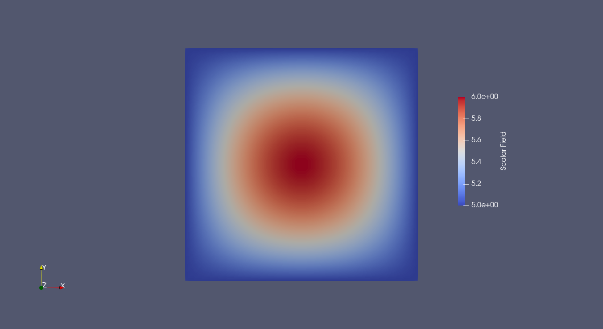
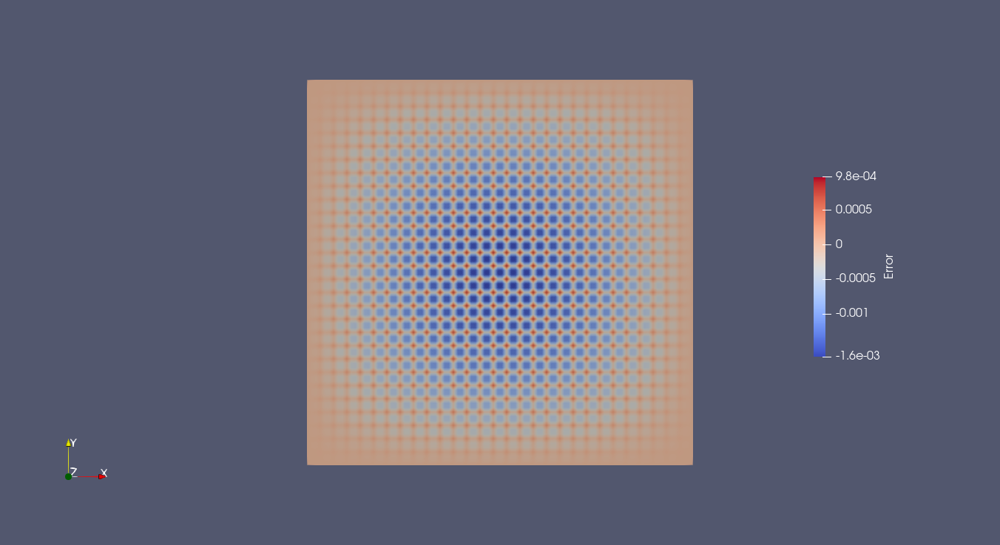

# Poisson Equation: Verification via Method of Manufactured Solutions

## Poisson

As the most simple problem we can solve, we begin with the Poisson Equation.


We will solve the Poisson Equation on the unit square:

$$
\Omega = [0,1]^2
$$

---

## Governing equations

The strong form:

$$
-\Delta u = f \quad \text{in } \Omega
$$

$$
u = g \quad \text{on } \Gamma
$$


---

##  Weak formulation

After multiplying by a test function and integrating by parts:

$$
\int_\Omega  \nabla u \cdot \nabla v \, d \Omega = \int_\Omega f v \, d \Omega
$$

We denote the $L^2(\Omega)$ inner product by:

$$
(u, v) := \int_\Omega u \cdot v \, d \Omega
$$

So the weak formulation becomes: find $u \in V_h \subset H^1(\Omega)$ such that

$$
(\nabla u, \nabla v) = (f, v) \quad \forall v \in V_h
$$

---

## Discretization

- Mesh type: structured
- Element: Quad4
- Function space:
  - $V_h \subset H^1$

Approximation:

$$
u_h = \sum_i U_i \phi_i
$$

---

## Implementation details
The full file implementation will be on [example_poisson.py](./example_poisson.py)


We begin our file with the needed imports:
```python
import numpy as np

from fem_engine.mesh import create_rectangle_mesh, FunctionSpace
from fem_engine.bcs import DirichletBC
from fem_engine.assembler import Assembler, assemble_scalar
from fem_engine.fem_solver import solve_newton_raphson
from fem_engine.element import Quad4
from fem_engine.postprocess import export_vtu
```

In order to compare the results, we will use the so caled "Method of Manufactured Solutions". That is, we will use a known solution to compare our results.

Our solution will be

$$
u = 5 + \sin(\pi x)\sin(\pi y)
$$

We define it:

```python
def u_exact(x, y):
  return 5 + np.sin(np.pi * x) * np.sin(np.pi * y)
```

The RHS source will be just its laplacian:

```python
def f_source(x, y):
    return 2 * np.pi**2 * np.sin(np.pi * x) * np.sin(np.pi * y)
```

We will define our weak form. As most of the code is built with nonlinear problems in mind, we will just pass everything to one side to get our residual.


```python
def poisson_weak_form(N, B_x, u_gp, grad_u, x_gp, e):
    """
    Evaluates: (grad_v * grad_u) - (v * f)
    For a scalar PDE, grad_u is shape (2, 1). B_x is shape (2, 4).
    """
    f_val = f_source(x_gp[0], x_gp[1])
    
    # Diffusion term: B_x.T * grad_u
    diff_term = B_x.T @ grad_u
    
    # Source term: N * f
    # so outer product results in shape (4, 1) matching diff_term.
    source_term = -np.outer(N, [f_val])
    
    return diff_term + source_term
```

Let's keep in mind that the arguments of the weak form could be named whatever, what matter most is their order. We could just rename them as we please, or to match a more "variational style" way:

```python
def poisson_weak_form(v, grad_v, u, grad_u, x, e):
    """
    Evaluates: (grad_v * grad_u) - (v * f)
    For a scalar PDE, grad_u is shape (2, 1). grad_v is shape (2, 4).
    grad_v is not actually \nabla v, but it serves the same purpose
    """
    f_val = f_source(x[0], x[1])
    
    # Diffusion term: grad_v * grad_u
    diff_term = grad_v.T @ grad_u
    
    # Source term: v * f
    # so outer product results in shape (4, 1) matching diff_term.
    source_term = -np.outer(v, [f_val])
    
    return diff_term + source_term
```

After defining our weak form, we will build our structured mesh
```python
mesh = create_rectangle_mesh(L=L, W=W, n_x=30, n_y=30, x0=0.0, y0=0.0)
```

We then define the function space, associating it with a mesh and type of element (in this case the usual lagrange bilinear quadrilateral)

```python
V = FunctionSpace(mesh, Quad4(), n_components=1)
```

We instantiate the assembler. ```quad_degree``` specifies the maximum polynomial degree that the Gauss-Legendre quadrature rule integrates exactly. This exactness assumes that the integrand on the reference element is polynomial, which is the case for affine mappings of polynomial finite elements.

The number of quadrature points is determined from the exactness requirement as:

$$
n = \left\lfloor \frac{\texttt{quad\_degree}+2}{2} \right\rfloor
$$

```python
assembler = Assembler(V, poisson_weak_form, quad_degree=2)
```

As for boundary conditions we will use a boundary marker function to find the boundary, which for a unity square is pretty simple. We will, however, use some tolerance for it

```python
def boundary_marker(x, y):
        tol = 1e-6
        return (abs(x) < tol or abs(x - L) < tol or 
                abs(y) < tol or abs(y - W) < tol)
```

We define our boundary conditions alongside a callback to feed to the solver later (the function signature for apply_bcs is the same whenever we want to use it). Our manufactured solution is exactly 5 on the boundary, so we use this value. We could also feed the exact solution instead with value=u_exact, which also works.

```python
bc = DirichletBC(V, value=5.0, boundary_marker_func=boundary_marker, component=0)

def apply_bcs(R, K, U):
    return bc.apply(R, K, U, method="strong")
```

We finally solve the problem, by creating a solution vector with the number of the dofs of the problem and passing it to a newton raphson solver alongside the weak form and boundary conditions

```python
U_final = np.zeros(V.ndofs)
U_final = solve_newton_raphson(U_final, assembler.assemble, apply_bcs)
```

Now to compare the order of the error we define our error in regards to the exact solution

```python
def l2_error_form(u_gp, grad_u, x_gp, e):
    x, y = x_gp
    u_ex = u_exact(x, y)
    return (u_gp - u_ex)**2
```

We must assemble it over our domain, which is done through the function ```assemble_scalar```

```python
total_error_sq = assemble_scalar(V, integrand=l2_error_form, u_sol=U_final, quad_degree=2)

L2_error = np.sqrt(total_error_sq)
print(f"L2 Norm Error: {L2_error:.6e}")
```

Which gives us

```
L2 Norm Error: 4.889074e-04
```

To export results to paraview, we can use the function ```export_vtu```. If we input the exact_func argument with an expression, it will export the value of the solution vector, U_final, minus it. That is, the error. ```n_vis_pts``` is an argument to have a more dense visualization mesh.

```
export_vtu(V, U_final, "results/poisson.vtu", field_name="Scalar Field")    
export_vtu(V, U_final, "results/poisson_error.vtu", field_name="Error", n_vis_pts=4, exact_func=u_exact)
```



And for the error plot



## Solving a linear system instead

Even if our problem is linear, we solved it with Newton-Raphson. We could just as well solve it in a linear way, by building the stiffness matrix originating from $$(\nabla u, \nabla v)$$

and the RHS from $$(f, v)$$

[example_poisson_linear.py](./example_poisson_linear.py) uses, instead of Newton-Raphson, a linear solve. The trick is when applying boundary conditions:

We had our variational problem defined earlier in matrix form as K*u - F = 0. Now instead we can just assemble our problem with a zero vector, then we get R = -F. With that we can just build the system differently and solve it with the function ```solve_linear```

```python
# Assemble K and R at U = 0
    U_final = np.zeros(V.ndofs)
    R_global, K_global = assembler.assemble(U_final)

    # Extract the load vector
    # Since our weak form is K*u - F = 0, evaluating at u = 0 returns R = -F
    # Thus, for rhs (as we want to solve K*u = F), F = -R

    # Apply BCs
    R_global, K_global = bc.apply(-R_global, K_global, U_final, method="strong", is_linear=True)

    # Finally solve the linear system
    U_final = solve_linear(K_global, R_global)
```

## Quadratic Elements

Instead of using bilinear quadrilaterals, we can also use quadratic lagrange quads.

It can be done just as easy as, instead of feeding a Quad4 to the FunctionSpace, to feed a Quad9.
Even if we use a linear mesh, Quad9() still works, although the geometric mapping won't be the same. That is, our problems may support sub, iso and superparametric FEM.

[example_poisson_elementquadratic.py](./example_poisson_elementquadratic.py) uses an isoparametric formulation, with quadratic elements. And, with same mesh size as earlier gives
```
L2 Norm Error: 6.506448e-06
```