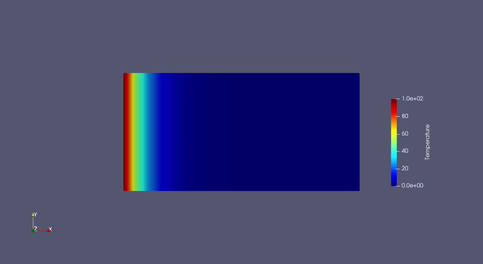

# Transient Heat Conduction with the $\theta$-Method

## Transient Heat Conduction

We will solve the transient heat conduction problem on a two-dimensional rectangular domain. The goal is to track the evolution of the temperature profile over time until it reaches a linear steady-state condition.

The domain is a rectangle defined by:

$$
\Omega = [0, L] \times [0, W]
$$

where $L = 2.0$ and $W = 1.0$.

---

## Governing equations

The strong form:

The transient heat conduction equation without internal heat generation is expressed as:

$$
\rho c \frac{\partial u}{\partial t} - \nabla \cdot (k \nabla u) = 0 \quad \text{in } \Omega
$$

where:
* $u(x,y,t)$ is the temperature field.
* $\rho c$ is the volumetric heat capacity (`rho_c = 1.0`).
* $k$ is the thermal diffusivity/conductivity (`k_diff = 1.0`).

### Boundary Conditions

* **Left Wall ($x = 0$):** Fixed hot temperature
$$u = 100.0$$

* **Right Wall ($x = L$):** Fixed cold temperature
$$u = 0.0$$

* **Top and Bottom Walls ($y = 0, y = W$):** Natural boundary conditions ($\nabla u \cdot \mathbf{n} = 0$).

* For the initial condition, we set $u(x,y,0) = 0$ in the interior of the domain, with the prescribed dirichlet boundary values imposed on the left and right boundaries.

---

##  Weak formulation
Multiplying the governing equation by a test function v and integrating the diffusion term by parts yields

$$
\int_\Omega \rho c \frac{\partial u}{\partial t} v \, d\Omega + \int_\Omega k \nabla u \cdot \nabla v \, d\Omega = 0
$$

### Temporal Discretization ($\theta$-Method)
Applying the generalized $\theta$-method for time-stepping, we approximate the time derivative via a finite difference scheme and evaluate the diffusion term as a weighted average between the current ($n+1$) and previous time ($n$) levels.

$$
\int_\Omega \rho c \left( \frac{u - u_{\text{old}}}{\Delta t} \right) v \, d\Omega + \theta \int_\Omega k \nabla u \cdot \nabla v \, d\Omega + (1 - \theta) \int_\Omega k \nabla u_{\text{old}} \cdot \nabla v \, d\Omega = 0
$$

Where:
* $\theta = 0.5$ yields the second-order **Crank-Nicolson** scheme.
* $\theta = 1.0$ yields the first-order implicit **Backward Euler** scheme.

---

### Weak Form

Given $u_{\text{old}}$ from the previous time step, find $u \in V_h \subset H^1(\Omega)$ such that:

$$
\int_\Omega \rho c \left( \frac{u - u_{\text{old}}}{\Delta t} \right) v \, d\Omega + \theta \int_\Omega k \nabla u \cdot \nabla v \, d\Omega + (1 - \theta) \int_\Omega k \nabla u_{\text{old}} \cdot \nabla v \, d\Omega = 0
$$

for all $v \in V_h$.

---

## Discretization

* **Mesh Type:** Structured rectangular grid
* **Element Type:** Quad4 (Bilinear quadrilateral elements)
* **Function Space:** $V_h \subset H^1(\Omega)$

---

## Implementation details
The full file implementation will be on [example_transient_heat.py](./example_transient_heat.py)


We begin our file with the needed imports:
```python
import numpy as np
import time

from fem_engine.mesh import create_rectangle_mesh, FunctionSpace
from fem_engine.bcs import DirichletBC
from fem_engine.assembler import Assembler, assemble_scalar
from fem_engine.fem_solver import solve_newton_raphson
from fem_engine.element import Quad4
from fem_engine.postprocess import export_vtu
```

We begin by defining the physical parameters

```python
# 1. Physics Parameters
L, W = 2.0, 1.0
k_diff = 1.0 # Thermal conductivity
rho_c = 1.0 # Volumetric heat capacity
```
We will define our weak form, note that there is an argument to the function called ```state```, we will use it to "feed" to the assembler previous values of the solution needed for the time stepping

```python
def transient_heat_weak_form(N, B_x, u, grad_u, x, e, state):
    dt = state['dt']
    theta = state['theta']
    u_old = state['u_old'] # Interpolated automatically
    grad_u_old = state['grad_u_old'] # Gradient interpolated automatically
    
    # 1. Rate of Change (Mass Matrix)
    # rho_c * (u - u_old) / dt
    transient_term = rho_c * np.outer(N, (u - u_old) / dt)
    
    # 2. Heat Flux (Stiffness Matrix)
    flux_now = k_diff * (B_x.T @ grad_u)
    flux_old = k_diff * (B_x.T @ grad_u_old)
    
    # Average the fluxes based on the chosen time-stepping scheme
    diffusion_term = theta * flux_now + (1.0 - theta) * flux_old
    
    # 3. Source term (assuming f = 0 for this example)
    # If we had a heat source, we would add: -np.outer(N, [source_val])
    
    return transient_term + diffusion_term
```

Next, we create the mesh, define the finite element space, initialize the assembler, and prescribe the boundary conditions


```python
mesh = create_rectangle_mesh(L=L, W=W, n_x=20, n_y=10, x0=0.0, y0=0.0)
V = FunctionSpace(mesh, Quad4(), n_components=1)

# Initialize Assembler (it detects 'state' in the signature automatically)
assembler = Assembler(V, transient_heat_weak_form, quad_degree=2)

# 4. Boundary Conditions ---
def left_wall_marker(x, y):
    return abs(x) < 1e-6
    
def right_wall_marker(x, y):
    return abs(x - L) < 1e-6

# Heat up the left wall to 100.0, keep the right wall frozen at 0.0
bcs = [
    DirichletBC(V, value=100.0, boundary_marker_func=left_wall_marker, component=0),
    DirichletBC(V, value=0.0, boundary_marker_func=right_wall_marker, component=0)
]

def apply_bcs(R, K, U):
    for bc in bcs:
        R, K = bc.apply(R, K, U, method="strong")
    return R, K
```

We can now define the time-stepping parameters and enter the solution loop.

```python
# 5. Time Stepping Setup
dt = 0.05
t_end = 5.0
current_time = 0.0

# Theta = 0.5 is Crank-Nicolson (2nd order)
# Theta = 1.0 is Backward Euler (1st order)
theta = 0.5 

# Initial Condition: U = 0 everywhere
U_n = np.zeros(V.ndofs)
```

And the time stepping loop will be

```python
step = 0
while current_time < t_end:
    current_time += dt
    step += 1
    print(f"\nStep {step} | Time: {current_time:.3f}s")
    
    # We package the history into global_params.
    # The Assembler handles slicing and interpolating this at the Gauss points.
    global_params = {
        'dt': dt,
        'theta': theta,
        'u_old': U_n  # Pass the global array
    }
    
    # Define a single-argument wrapper for the Newton-Raphson solver, since solve_newton_raphson expects a single-argument assembly function, we wrap the assembler in a closure that captures global_params
    def current_assembly(U_guess):
        return assembler.assemble(U_guess, global_params=global_params)
        
    # Solve the nonlinear step (or linear in this case, converges in 1 iteration)
    start_solve = time.time()
    U_next = solve_newton_raphson(U_n.copy(), current_assembly, apply_bcs)
    print(f"-> Solved in {time.time() - start_solve:.3f}s")
    
    # Update history for the next step
    U_n = U_next.copy()

    export_vtu(V, U_next, f"results/temperature_{step:04d}.vtu", field_name="Temperature")
```

A few things to comment on the above snippet: ```dt``` and ```theta``` are scalars, numbers, they go to the weak form exactly as they are. Now with the use of ```global_params``` we pass the ```u_old``` as ```U_n```. The assembler automatically will generate a second variable with the name ```grad_u_old``` inside of it. **So the naming must match inside the weak form and the global_params for the fields**

The exact steady state solution will be
$$
u = 100 (1- x/L)
$$

So we will assemble the error as well (after the time steps our solution has entered steady state already)


```python
def l2_steady_state_error(u_gp, grad_u, pos_gp, e):
    x, y = pos_gp
    u_exact = 100.0 * (1.0 - x / L)
    return (u_gp - u_exact)**2

l2_error = np.sqrt(assemble_scalar(V, integrand=l2_steady_state_error, u_sol=U_n, quad_degree=2))

print(f"Final L2 Error Norm: {l2_error:.4e}")
```

```
--- Verifying Steady-State Accuracy ---
Final L2 Error Norm: 2.5326e-04
```



